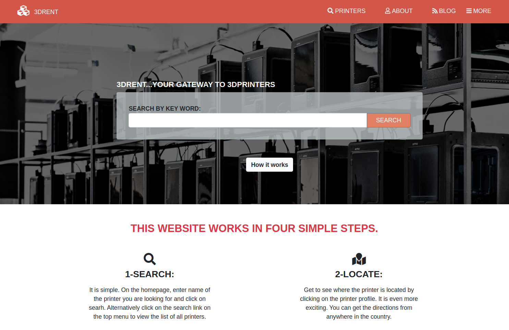

# NewsWeek Clone

> In this project I created NewsWeek page with Bootstrap framework.

## Built With

- HTML
- CSS
- Bootstrap

## Live Demo

[Live Demo Link](https://ahmetbozaci.github.io/NewsWeek-Clone/)

## Project Requirements

- You can find the original project specification at [The Odin Project](https://www.theodinproject.com/courses/html5-and-css3/lessons/using-bootstrap).

## Author

👤 **Ahmet Bozacı**

- Github: [@ahmetbozaci ](https://github.com/ahmetbozaci)
- Twitter: [@ahmtbozaci](https://twitter.com/ahmtbozaci)
- Linkedin: [linkedin](https://www.linkedin.com/in/ahmetbozaci/)

## Show your support

Give a ⭐️ if you like this project!